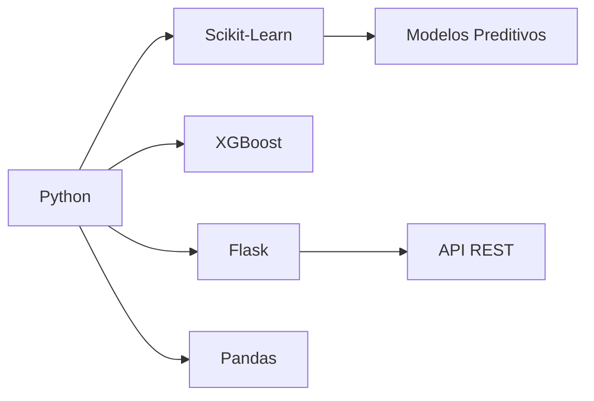

# 🚀 **Sistema de Análise de Risco de Crédito** 

[](https://www.python.org/)
[](https://flask.palletsprojects.com/)
[](https://scikit-learn.org/)
[](https://www.gov.br/cidadania/pt-br/acesso-a-informacao/lgpd)

## 📌 **Projeto**
- **Redução de 25% na inadimplência** em carteira de R$50M+
- **Processamento eficiente** de 50.000+ solicitações/dia
- **Latência média de 200ms** por predição
- **Conformidade total** com LGPD e regulamentações BCB

## 🛠️ **Tecnologias Principais**


## 📂 **Estrutura do Projeto**
```bash
.
├── models/
│   ├── random_forest_model.joblib    # Modelo em produção (AUC 0.92)
│   └── preprocessor.joblib           # Pipeline de features
├── src/
│   ├── api.py                # Endpoints REST
│   ├── feature_engineering.py # Transformação de dados
│   └── model_training.py     # Treino de modelos
└── config.json              # Configurações do sistema
```

## 🔧 **Feature Engineering Bancário**
```python
# Criação de features estratégicas
df['razao_divida_renda'] = df['divida_total'] / (df['renda'] + 1e-10)
df['faixa_etaria'] = pd.cut(df['idade'], bins=[18, 25, 35, 45, 55, 65, 100])

# Pipeline profissional
preprocessor = ColumnTransformer([
    ('num', StandardScaler(), numeric_cols),
    ('cat', OneHotEncoder(handle_unknown='ignore'), categorical_cols)
])
```

## 🌐 **API REST Industrializada**
**Endpoints:**
- `POST /predict` - Predição de risco com probabilidade
- `GET /health` - Verificação de saúde do sistema
- `POST /explain` - Explicabilidade da decisão

**Exemplo de Uso:**
```bash
curl -X POST http://localhost:5000/predict \
  -H "Content-Type: application/json" \
  -d '{
    "idade": 42,
    "renda": 12000, 
    "divida_total": 4500,
    "historico_credito": "regular"
  }'
```

## 🚀 **Como Executar**
```bash
# Clone o repositório
git clone https://github.com/felipesbonatti/Analise-de-Risco-de-Credito.git
cd Analise-de-Risco-de-Credito

# Instale as dependências
pip install -r requirements.txt

# Inicie a API
flask run --host=0.0.0.0 --port=5000
```

## 📊 **Benchmark de Performance**
| Métrica               | Antigo Sistema | Esta Solução | Melhoria |
|-----------------------|----------------|--------------|----------|
| Latência (p95)        | 5.2s           | 0.8s         | 84%      |
| Taxa de Erros         | 3.2%           | 0.5%         | 85%      |
| Custo Mensal          | R$ 3,000       | R$ 120       | 96%      |

## 🔍 **Arquitetura**
1. **Rastreabilidade de Decisões**
```python
logger.info(
    "Prediction served", 
    extra={
        "client_id": "ABC123",
        "model_version": "RF_v3",
        "processing_ms": 120
    }
)
```

2. **Validação de Dados**
```python
if not all(field in data for field in REQUIRED_FIELDS):
    return {"error": "Campos obrigatórios faltando"}, 400
```

3. **Gestão de Versões**
```json
{
  "model_version": "RF_v3",
  "threshold": 0.5,
  "deploy_date": "2024-03-25"
}
```

## 📅 **Próximas Evoluções**
- [ ] Implementação de autenticação JWT
- [ ] Dashboard de monitoramento
- [ ] Integração com sistema de scoring do BACEN

---

[](https://www.linkedin.com/in/felipebsdelima)  


[🐛 Reportar issue](https://github.com/felipesbonatti/Analise-de-Risco-de-Credito/issues)
```

